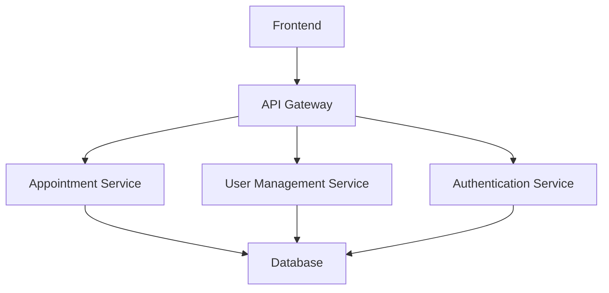

# Edubridge
EduBridge is a mobile-friendly, offline-accessible digital learning hub that provides free educational resources to Nigerian students. It tackles limited digital access, poor learning environments, and employment skill gaps through a low-data platform that offers interactive courses, mentorship, and skill-based training. 

ER Diagram 
 link: 


# eduBridge 🏥

## Overview
eduBridge is an open-source educare management platform designed to streamline medical appointments, patient management, and educare provider coordination.

### Key Features
- 🩺 Doctor Appointment Booking
- 📋 Patient Management
- 🏥 Hospital/Provider Network
- 🔐 Secure User Authentication

### Tech Stack
- Backend: Node.js, TypeScript
- Database: SQLite
- ORM: Sequelize
- Authentication: JWT
- Containerization: Docker

## Quick Start

### Prerequisites
- Node.js (v18+)
- Docker (optional)

### Installation
```bash
# Clone the repository
git clone https://github.com/stevesdiary/edu-bridge.git

# Navigate to project directory
cd edu-bridge

# Install dependencies
npm install

# Setup environment variables
cp .env.example .env

# Run database migrations
npm run migrate

# Start development server
npm run dev
```

## Contributing Guidelines
[Link to CONTRIBUTING.md]


# Contributing to EduBridge

## Welcome Contributors! 🌟

We're thrilled that you're interested in contributing to EduBridge. This document provides guidelines for contributing to our project.

### Code of Conduct
- Be respectful
- Be inclusive
- Collaborate constructively

### How to Contribute

#### 1. Development Setup
1. Fork the repository
2. Clone your forked repository
3. Create a new branch:
```bash
git checkout -b feature/your-feature-name
```

#### 2. Development Workflow
- Ensure code follows our style guide
- Write unit tests for new features
- Run linters and formatters
```bash
npm run lint
npm run test
```

#### 3. Commit Guidelines
- Use conventional commits
- Prefix commits with type:
  - `feat:` New feature
  - `fix:` Bug fix
  - `docs:` Documentation changes
  - `refactor:` Code refactoring
  - `test:` Adding tests
  - `chore:` Maintenance tasks

Example:
```bash
git commit -m "feat: add patient appointment booking feature"
```

#### 4. Pull Request Process
1. Ensure all tests pass
2. Update documentation if needed
3. Provide a clear PR description
4. Link any related issues

### Reporting Issues
- Use GitHub Issues
- Provide detailed information
- Include:
  - Steps to reproduce
  - Expected behavior
  - Actual behavior
  - Environment details

### Development Environment

#### Required Tools
- Node.js v18+
- PostgreSQL v13+
- Docker (recommended)
- VSCode or similar IDE

#### Recommended Extensions
- ESLint
- Prettier
- TypeScript intellisense

### Security Reporting
For security vulnerabilities, please email security@edubridge.org

# EduBridge Architecture

## High-Level Architecture


## Microservices Overview
1. **Authentication Service**
   - Handles user registration
   - Manages JWT tokens
   - Implements role-based access control

2. **Appointment Service**
   - Manages doctor-patient appointments
   - Handles scheduling logic
   - Implements reminder systems

3. **User Management Service**
   - Manages patient and doctor profiles
   - Handles user data updates

## Database Schema
[Link to database schema documentation]

## API Documentation
[Link to Swagger/OpenAPI documentation]


# Contributor Covenant Code of Conduct

## Our Pledge
We are committed to providing a friendly, safe, and welcoming environment for all contributors.

## Expected Behavior
- Be respectful and inclusive
- Be patient with others
- Provide constructive feedback
- Collaborate openly

## Unacceptable Behavior
- Harassment
- Discriminatory language
- Trolling
- Personal attacks

## Enforcement
Violations can result in:
- Verbal warning
- Temporary or permanent ban from the project


# Security Policy

## Supported Versions
| Version | Supported          |
|---------|-------------------|
| 1.0.x   | :white_check_mark:|
| < 1.0   | :x:               |

## Reporting a Vulnerability
1. Email: security@edubridge.org
2. Encrypt communication if possible
3. Provide detailed information about the vulnerability

## Security Best Practices
- Never commit sensitive information
- Use environment variables
- Implement proper authentication
- Regular dependency updates


# EDUBRIDGE Project

This is the repository for the TCU project. Follow the steps below to set up and run the project locally.

## Prerequisites

- [Node.js](https://nodejs.org/) installed on your machine
- [npm](https://www.npmjs.com/) (Node Package Manager) installed

## Getting Started

1. **Clone the repository**  
   Open your terminal and run the following command:
```bash
   git clone https://github.com/stevesdiary/edu-bridge.git
```

2. **Navigate to the project directory**  
Change your directory to the cloned repository:
```bash
cd edu-bridge
```
3. **Install dependencies**  
Run the following command to install the required packages:
```bash
npm install
```

4. **Start the development server**  
Use the following command to start the server:
```bash
npm run dev
```
